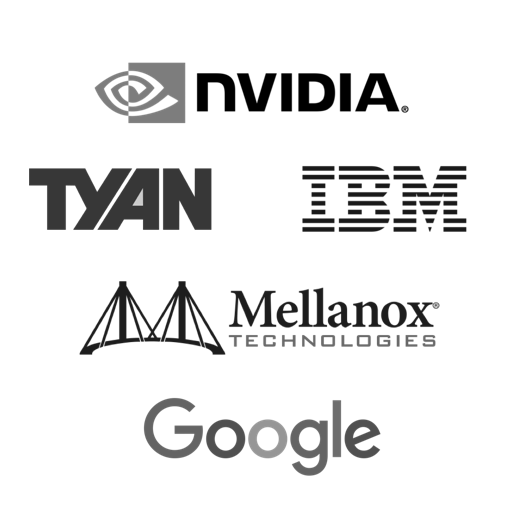
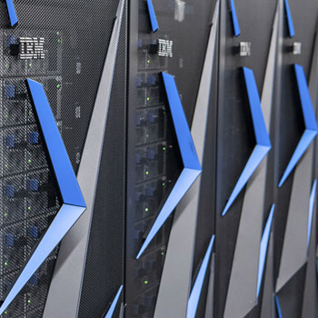
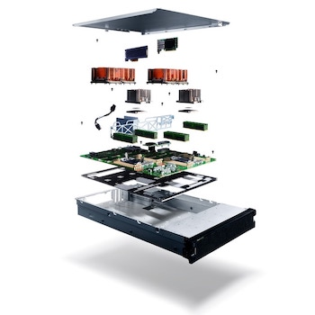

---

title: OpenPOWER learnings

---

## Ecosystem learnings

Background | Successes | Learnings

 
 

Mandie Quartly PhD, IBM Power Ecosystem
[@mandieq](https://twitter.com/mandieq)

---

# Background

 <!-- .element style="border: 0; background: None; box-shadow: None" width="100px" -->

----

## What is the OpenPOWER Foundation?

> The goal of the OpenPOWER Foundation is to create an open ecosystem, using the POWER Architecture to share expertise, investment, and server-class intellectual property to serve the evolving needs of customers and industry.

Speed to innovation | Standards | Choice

Notes: So what about the OpenPOWER Foundation? Here is the mission statement.

1. **Speed of innovation** – enabling radical innovation of products, markets and business models by quickly exploiting new technologies
2. **Integration** – is about open standards – creating building blocks which all fit together
3. **Choice** – competition drives prices to the right place, no vendor lock in.

----

<!-- .slide: data-background="images/opf_members.png" -->

More than 350 members today

Notes: Which in practise means what?

An organisation today with more an 350 members and increasing.

----

<!-- .slide: data-background="images/opf_members.png" -->

Ranging across many types of partner

Notes: Those members range a huge amount in size and type.

But let's rewind a bit. Why did OpenPOWER come into being?

----

<!-- .slide: data-background="images/rocket.png" -->

## Why OpenPOWER?

"Houston, we have a problem..."

Notes: Problem is:
- death of Moore's law: inability to squeeze more transistors into smaller space,
- not getting price / performance increase used to get with new processors
- at the same time needing more from the tech with technologies like AI  
  - getting real time insights from data / training neural networks.
- needing to take a holistic view, what are the pieces around the processor where we can find performance increases?

End users - are the ones needing that ever increasing performance while maintaining cost.

----

## In the beginning

Founded in 2013

 <!-- .element width="400px" -->

Notes: OpenPOWER founded in 2013

----

## OpenPOWER today

<!-- .slide: data-background-iframe="https://openpowerfoundation.org/" -->

Notes: Annual summits in the US, EU and China.

---

# Successes

 <!-- .element style="border: 0; background: None; box-shadow: None" width="100px" -->

----

## Coming of age

Announced in August 2019:

* Opening up of IBM POWER Instruction Set Architecture (ISA)
* OpenCAPI and Open Memory Interface (OMI) reference designs released
* Move to Linux Foundation governance model

Notes: In August of this year OpenPOWER made some really big announcements.

----

## Tangible outcomes

[The World's Fastest Supercomputers](https://www.ibm.com/thought-leadership/summit-supercomputer/)

[OpenPOWER Ready Solutions](https://openpowerfoundation.org/technical/resource-catalog/)

Hardware | Software | Documents | Tools | Reference architectures
| Manuals | Cloud Resources | ...

---

# Learnings

 <!-- .element style="border: 0; background: None; box-shadow: None" width="100px" -->

Caveat - my personal views

----

### Getting things done

> I need to get data between my processor and GPU super quickly!

> What about applications for my specific industry?

Working groups to focus on specific areas

Plus:

Board of Directors | Technical Steering Committee | Marketing Committee

----

<!-- .slide: data-background="images/blocks-cubes-letter-cubes-1887614.jpg" -->

## Think about the full stack

And all the pieces around the outside / at either end

Notes: Need a range of types of partners to get to the end goal.

- Researchers,
- people with a focus on the various building blocks which make the stack,
- people to bring the stack together and connecting those blocks,
- people to take stack to market,
- people to install and maintain the stack.

----

## WIIFM?

- End users? <!-- .element: class="fragment" data-fragment-index="1" -->
- Revenue? <!-- .element: class="fragment" data-fragment-index="2" -->
- Partnerships with bigger companies? <!-- .element: class="fragment" data-fragment-index="3" -->
- Access to building blocks? <!-- .element: class="fragment" data-fragment-index="4" -->
- Getting ahead of competition? <!-- .element: class="fragment" data-fragment-index="5" -->

What's in it for me?

Notes: A really important question is "What's in it for me?". What do partners in the ecosystem care about? Can be hugely different for different partners.

----

## And when do I get it?

- Time spent vs time to rewards seen
- Smaller organisations are time poor and need rewards now.
- Larger organisations can afford to invest and wait.

----

<!-- .slide: data-background="images/boy-and-girl-sitting-on-bench-toy-1767434.jpg" -->

## No favourite child

Working with competitors

----

### If you build it t(he)y will come.

Or will they?

 

- Ambassadors program
- Developers program
- Recognise achievements

---

# Summary

WIIFM?

Open / choice drives innovation

It can take time

---

# Useful links

* [Governance](https://openpowerfoundation.org/about-us/governance/)
* [Working Groups](https://openpowerfoundation.org/technical/working-groups/)
* [Membership levels and benefits](https://openpowerfoundation.org/membership/benefits/)

 
 
 
 

Background images from [Pexels](https://www.pexels.com/)

